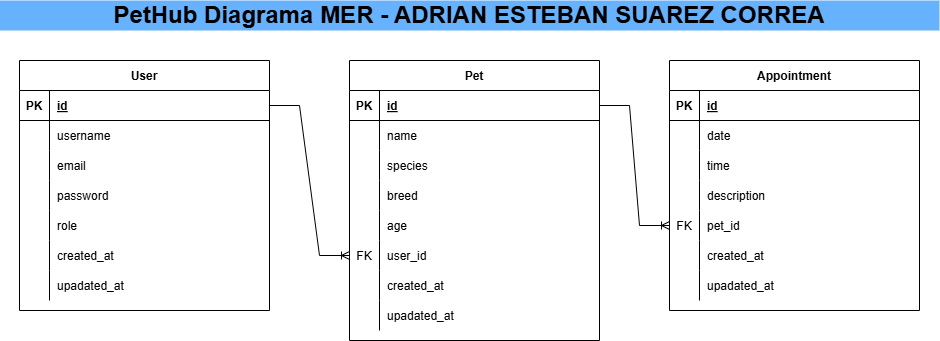

# PetHub: Sistema Integral de Gestión de Mascotas y Citas Veterinarias

## Descripción General del Proyecto

**PetHub** es una aplicación web Fullstack diseñada para simplificar la gestión de mascotas y la programación de citas veterinarias. Permite a los dueños de mascotas registrarse, añadir y administrar la información de sus animales, y solicitar citas. Incluye un robusto sistema de autenticación y autorización basado en roles, diferenciando las capacidades de los usuarios normales de las de un administrador.

Este proyecto ha sido desarrollado siguiendo una arquitectura modular con un backend API REST y un frontend SPA (Single Page Application), demostrando un conocimiento integral del desarrollo Fullstack.

## Características Principales

### 🐾 **Gestión de Usuarios y Autenticación**
* **Registro de Usuarios:** Creación segura de nuevas cuentas de usuario.
* **Inicio de Sesión:** Autenticación de usuarios mediante credenciales (email y contraseña) con generación y validación de JSON Web Tokens (JWT) para mantener sesiones seguras.
* **Gestión de Perfil:** Acceso a los datos del perfil del usuario autenticado.
* **Autorización por Roles:** Implementación de dos roles principales:
    * **`user` (Usuario Normal):** Puede registrar y listar sus propias mascotas y citas.
    * **`admin` (Administrador):** Tiene control total (CRUD) sobre todas las mascotas y citas del sistema.

### 🐶 **CRUD de Mascotas**
* **Crear Mascota:** Los usuarios pueden añadir nuevas mascotas a su perfil.
* **Listar Mascotas:** Los usuarios normales pueden ver solo sus mascotas; los administradores pueden ver todas las mascotas del sistema.
* **Actualizar Mascota:** Los dueños de mascotas (o un administrador) pueden modificar la información de sus mascotas.
* **Eliminar Mascota:** Los dueños de mascotas (o un administrador) pueden eliminar mascotas.

### 📅 **CRUD de Citas Veterinarias**
* **Crear Cita:** Los usuarios pueden programar citas para sus mascotas asociadas.
* **Listar Citas:** Los usuarios normales pueden ver solo sus citas; los administradores pueden ver todas las citas del sistema.
* **Actualizar Cita:** **Solo los administradores** pueden modificar los detalles de cualquier cita.
* **Eliminar Cita:** **Solo los administradores** pueden cancelar o eliminar citas.

## Tecnologías Utilizadas

### **Backend (API REST)**
* **Node.js:** Entorno de ejecución JavaScript.
* **Express.js:** Framework web minimalista y flexible para construir la API.
* **PostgreSQL:** Sistema de gestión de bases de datos relacional.
* **Sequelize ORM:** Object-Relational Mapper para interactuar con la base de datos de forma programática con JavaScript.
* **JWT (JSON Web Tokens):** Para la autenticación y autorización segura basada en tokens.
* **Bcrypt.js:** Para el hash seguro de contraseñas.
* **Dotenv:** Para la gestión de variables de entorno.
* **CORS:** Middleware para habilitar el intercambio de recursos de origen cruzado (comunicación entre frontend y backend).

### **Frontend (SPA - Single Page Application)**
* **React.js:** Librería de JavaScript para construir interfaces de usuario interactivas.
* **React Router DOM:** Para la navegación y el enrutamiento declarativo en la aplicación.
* **Axios:** Cliente HTTP basado en promesas para realizar peticiones al backend.
* **Context API (React):** Para la gestión del estado global de autenticación.
* **CSS Puro:** Estilización personalizada y diseño responsivo para una experiencia de usuario atractiva.

## Estructura del Proyecto (Monorepo)

El proyecto está organizado como un monorepo, lo que significa que el backend y el frontend residen en un único repositorio Git.

## Diagrama Entidad-Relación (MER)

En la carpeta se presenta el diagrama MER de la base de datos, mostrando las entidades (`Users`, `Pets`, `Appointments`) y sus relaciones.



## Cómo Ejecutar el Proyecto Localmente

Para poner en marcha la aplicación en tu máquina local, sigue estos pasos:

### **Prerrequisitos:**
* **Node.js y npm:** Asegúrate de tener Node.js (v18.x o superior) y npm (v8.x o superior) instalados.
* **PostgreSQL:** Ten una instancia de PostgreSQL corriendo en tu sistema (por defecto en `localhost:5432`).
* **Git:** Para clonar el repositorio.

### **Pasos de Instalación y Ejecución:**

1.  **Clonar el Repositorio:**
    ```bash
    git clone [https://github.com/adriansuarezmtl/PetHub-Fullstack.git](https://github.com/adriansuarezmtl/PetHub-Fullstack.git)
    ```

2.  **Configurar el Backend:**
    a.  **Navegar al directorio del backend:**
        ```bash
        cd pethub-backend
        ```
    b.  **Instalar dependencias:**
        ```bash
        npm install
        ```
    c.  **Configurar variables de entorno:**
        * Crea un archivo llamado `.env` en la raíz de la carpeta `pethub-backend`.
        * Copia el contenido del archivo `env.example` (si lo creaste) o pega lo siguiente, **reemplazando los valores placeholders** con tus credenciales de PostgreSQL:
            ```env
            PORT=5000
            DB_USER=tu_usuario_postgres
            DB_HOST=localhost
            DB_DATABASE=pethub_db
            DB_PASSWORD=tu_contraseña_postgres
            DB_PORT=5432
            JWT_SECRET=una_clave_secreta_fuerte_para_jwt
            ```
    d.  **Crear la base de datos en PostgreSQL:**
        * Abre una terminal de `psql` (o usa pgAdmin 4) y ejecuta:
            ```sql
            CREATE DATABASE pethub_db;
            ```
    e.  **Iniciar el servidor backend:**
        * Asegúrate de que PostgreSQL esté corriendo.
        * En la terminal, ejecuta:
            ```bash
            node server.js
            ```
        * Verás un mensaje como `Base de datos sincronizada correctamente.` y `Servidor de PetHub ejecutándose en el puerto 5000`. Mantén esta terminal abierta.

3.  **Configurar el Frontend:**
    a.  **Abrir una NUEVA terminal.**
    b.  **Navegar al directorio del frontend:**
        ```bash
        cd pethub-frontend
        ```
    c.  **Instalar dependencias:**
        ```bash
        npm install
        ```
    d.  **Iniciar la aplicación frontend:**
        ```bash
        npm start
        ```
        * Esto abrirá automáticamente la aplicación en tu navegador en `http://localhost:3000`. Mantén esta terminal abierta.

## Uso de la Aplicación

1.  **Página de Inicio (`/`):** Verás la imagen de bienvenida con opciones para "Registrarse" o "Iniciar Sesión".
2.  **Registrarse (`/register`):** Crea una nueva cuenta de usuario.
3.  **Iniciar Sesión (`/login`):** Accede a tu cuenta.

4.  **Creación de Usuarios y Administrador para Pruebas:**
    * Para probar las funcionalidades de `user` (usuario normal), regístrate directamente desde el formulario en `http://localhost:3000/register`.
    * **Para probar las funcionalidades de `admin` (administrador), es necesario crear una cuenta con el rol `admin`:**
        * Abre una herramienta como **Insomnia** o **Postman**.
        * Crea una petición **`POST`** a la URL: **`http://localhost:5000/api/auth/register`**.
        * En el **`Body`** de la petición, selecciona **`JSON`** y envía los siguientes datos (ejemplo):
            ```json
            {
                "username": "admin_test",
                "email": "admin_test@pethub.com",
                "password": "admin_password_123",
                "role": "admin"
            }
            ```
        * Una vez registrado, podrás iniciar sesión en el frontend (`http://localhost:3000/login`) con `admin_test@pethub.com` y `admin_password_123` para acceder a las funcionalidades de administrador.

5.  **Navegación (después de Iniciar Sesión):** Una vez que inicies sesión, aparecerá una barra de navegación superior que te permitirá acceder a:
    * **Mis Mascotas (`/pets`):** Gestiona tus mascotas (Crear, Listar, Editar, Eliminar).
    * **Mis Citas (`/appointments`):** Gestiona tus citas (Crear, Listar, Editar [solo Admin], Eliminar [solo Admin]).
    * **Área Privada (`/private`):** Una página de ejemplo protegida.

---
## Agradecimientos

Quiero expresar mi gratitud a mi instructor por su guía y apoyo continuo durante el desarrollo de este proyecto. Su experiencia y dirección fueron fundamentales para el éxito.
**¡Gracias por su guía y apoyo durante el desarrollo de este proyecto, instrutor Michael Vega!**